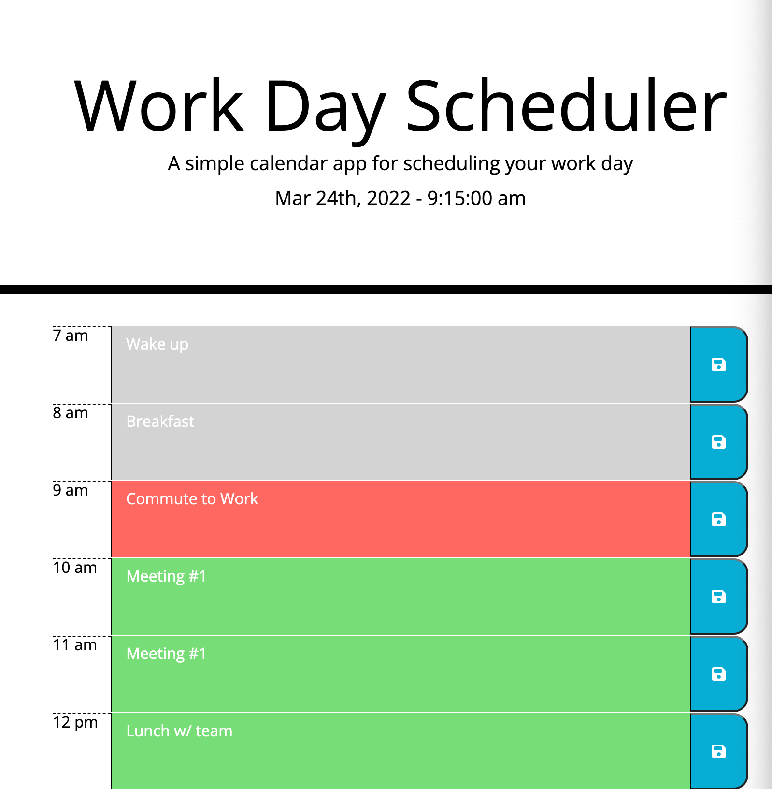

# Work Day Scheduler

## Description
A simple calendar application that allows a user to save events for each hour of the day. This app will run in the browser and feature dynamically updated HTML and CSS powered by jQuery. The code highlights basic usage of the:
- Code to dynamically build the schedule HTML
- Use of JavaScript timer and event functions
- Writing and reading from local browser storage
- Leveraging jQuery for efficient code design

## Installation

There are no installation requirements except to open the single `index.html` page or visit the page: https://qkeddy.github.io/work-day-scheduler/.

## Sample Usage

The following image is a static image of the scheduler.

## Credits

N/A

## License

N/A

---

